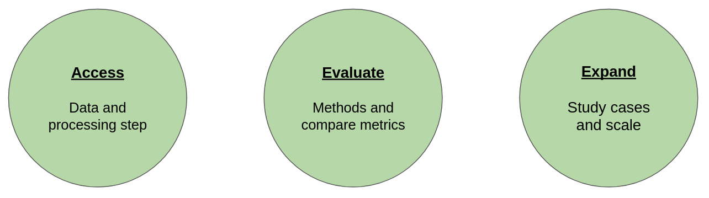

# Ocean Observation Science Toolkit: SSH Data challenge Design


## Overall presentation
This project comes with 
This jupyter book demonstrate through a series of notebooks how a combination of tools

We provide here the documentation and example notebooks associated with  `https://github.com/quentinf00/oost-dc-ose-2021.git`.
This aims at laying foundations for building an ecosystem to facilitate the development and application of ocean observation science

This work is built upon existing work that you should check out !

## Background: On the shoulder of Giants:
- **[Ocean-data-challenges](https://ocean-data-challenges.github.io/)** provide:
    - well thought evaluation use cases
    - input data download instructions
    - metrics code and notebooks to evaluate methods
-  **[OceanBench](https://jejjohnson.github.io/oceanbench/content/overview.html)** provide:
    -  suite of tools  and configuration for developing ML application
-  **[Hydra](https://hydra.cc/docs/intro/) and [Hydra-zen](https://mit-ll-responsible-ai.github.io/hydra-zen/)** provide:
    -  Python <-> Configuration workflow (share code, adapt config) 
    -  CLI integration
    -  easy // computing (local, cluster), logging 
-  **[DVC](https://dvc.org/doc/use-cases)** provides:
    -  data versioning (git for data)
    -  pipeline parameters and artefacts description and orchestration (make for data science)

## Feature Showcase
We provide through the following notebooks and associated 5 min walkthrough videos demonstrations on the new features brought by this implementations

- Versioned data access and reproduction for data challenges
<iframe width="560" height="315" src="https://www.youtube.com/embed/9sMfMNRIaJA?si=2r3As5ZdwhrWZkPk" title="YouTube video player" frameborder="0" allow="accelerometer; autoplay; clipboard-write; encrypted-media; gyroscope; picture-in-picture; web-share" referrerpolicy="strict-origin-when-cross-origin" allowfullscreen></iframe>

- Metrics computation and automated leaderboard update
- Configuring new usecases and scaling to operations

## Contributing
The idea of this project is to define the guidelines so that different actors can add their brick to the ecosystem while providing good interoperability with exitings components.
The following examples aims at clarifying how to do so:
_To be continued_


```{tableofcontents}
```
