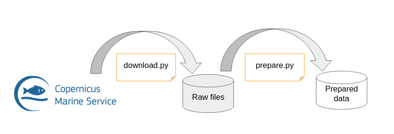

---
jupytext:
  text_representation:
    extension: .md
    format_name: myst
    format_version: 0.13
    jupytext_version: 1.16.1
kernelspec:
  display_name: OcbDocs
  name: ocb-docs
---


# Data Access for the Oceanbench v2 datachallenge demo


## Reusing processing steps and reproducing data preparation

### Use the configured `ocb-dc_ose_2021-input_data` pipeline


#### Reproduce processing of single satellite

```{code-cell}
---
tags:
  - scroll-output
---
!ocb-dc_ose_2021-input_data params.sat=j2g
```

```{code-cell}
import xarray as xr
ds = xr.open_mfdataset('data/prepared/input/*.nc', combine='nested',concat_dim='time')
ds
```

```{code-cell}
# 2D map
bin_size = 1/20
(
    ds.sel(time='2017-08-01').assign(
        lat=ds.lat / bin_size // 1 * bin_size,
        lon=ds.lon / bin_size // 1 * bin_size
    )[['ssh', 'lat', 'lon']].load()
    .drop_vars('time')
    .to_dataframe()
    .groupby(['lat', 'lon']).mean()
    .to_xarray()
).ssh.plot()
```

#### Dry (without actual execution) run for all satellites

```{code-cell}
!ocb-dc_ose_2021-input_data --multirun dry=True
```

## Downloading versioned and preprocessed data

### Listing datachallenge content

```{code-cell}
# Storing the repo url for convenience
%env DC_REPO=https://github.com/quentinf00/ocb-dc-ose-2021.git
```

```{code-cell}
# Listing and pretty printing all files of the datachallenge
!dvc ls -R $DC_REPO datachallenge/data | tree --fromfile
```

### Downloading prepared input data

```{code-cell}
!dvc get -q $DC_REPO datachallenge/data/prepared/input
```

```{code-cell}
!tree input
```


### Visualize input data

```{code-cell}
ds = xr.open_mfdataset('input/*.nc', combine='nested',concat_dim='time')
ds
```

```{code-cell}
# 2D map
bin_size = 1/20
(
    ds.sel(time='2017-08-01').assign(
        lat=ds.lat / bin_size // 1 * bin_size,
        lon=ds.lon / bin_size // 1 * bin_size
    )[['ssh', 'lat', 'lon']].load()
    .drop_vars('time')
    .to_dataframe()
    .groupby(['lat', 'lon']).mean()
    .to_xarray()
).ssh.plot()
```

### Checking generated data VS downloaded

```{code-cell}
xr.testing.assert_allclose(
    xr.open_dataset('data/prepared/input/j2g.nc'),
    xr.open_dataset('input/j2g.nc'),
)
print("Successful reproduction")
```


### More on pipeline usage (help, doc, ...)

```{code-cell}
!ocb-dc_ose_2021-input_data --help
```

```{code-cell}
!ocb-dc_ose_2021-input_data params.sat=alg dry=True 'hydra.verbose=[aprl.appareil]'
```
