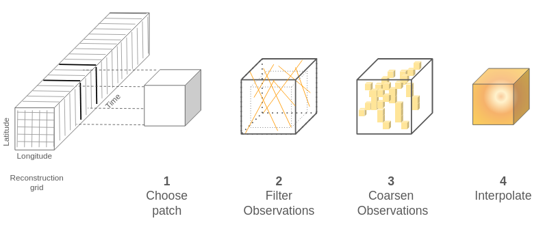
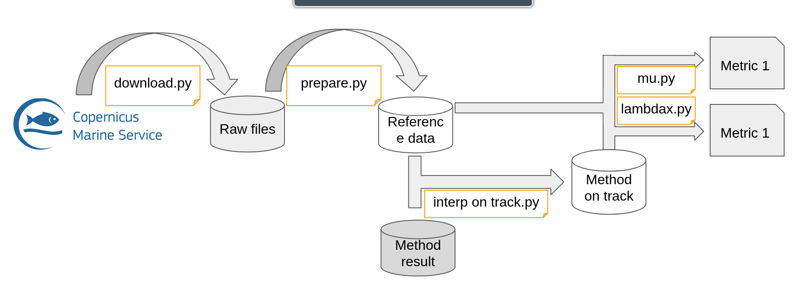
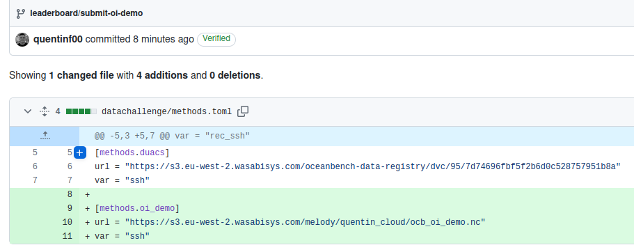
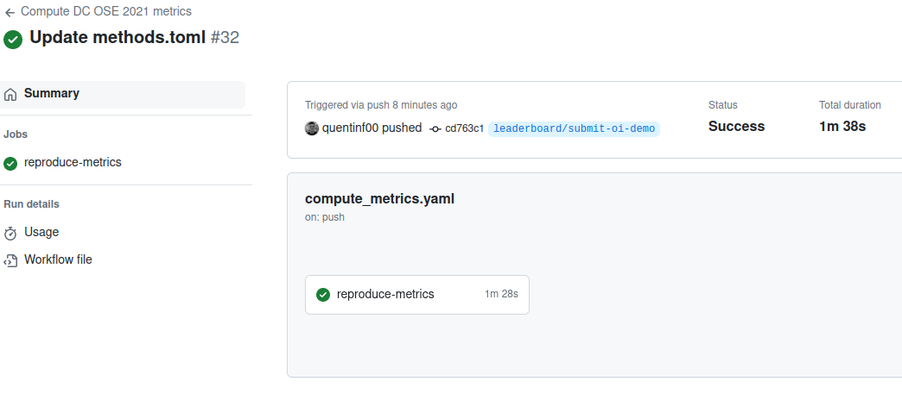
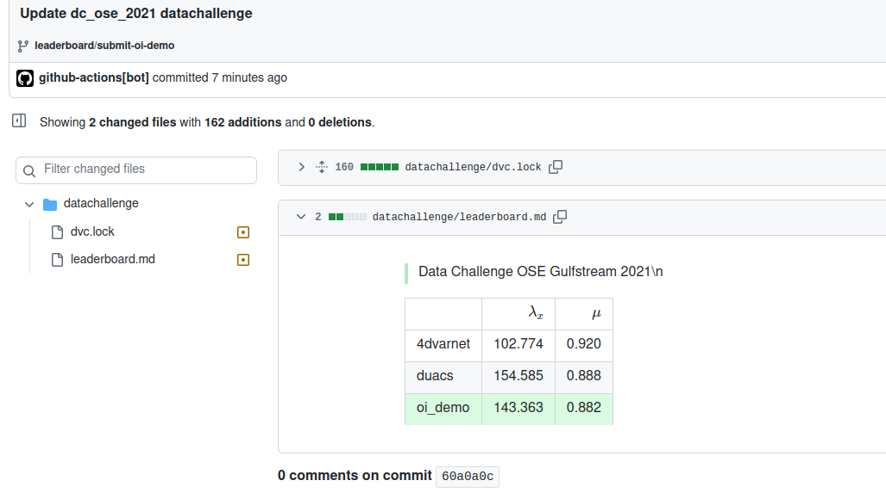

---
jupytext:
  text_representation:
    extension: .md
    format_name: myst
    format_version: 0.13
    jupytext_version: 1.16.1
kernelspec:
  display_name: oost
  name: oost-docs
---


# Participating to the data challenge: applying, evaluating and submitting a method 

## Fetching the input data

More detail in [](./oost_dc_ose_2021_data.md)
```{code-cell}
---
tags:
  - scroll-output
---
!dvc get https://github.com/quentinf00/oost-dc-ose-2021.git datachallenge/data/prepared/input
```

```{code-cell}
---
tags:
  - hide-input
---
import xarray as xr
obs = xr.open_mfdataset('input/*.nc', combine='nested',concat_dim='time')
bin_size = 1/20
(
    obs.sel(time='2017-01-01').assign(
        lat=obs.lat / bin_size // 1 * bin_size,
        lon=obs.lon / bin_size // 1 * bin_size
    )[['ssh', 'lat', 'lon']].load()
    .drop_vars('time')
    .to_dataframe()
    .groupby(['lat', 'lon']).mean()
    .to_xarray()
).ssh.plot()
```


### Applying my method: Basic optimal interpolation




```{code-cell}
---
tags:
  - hide-cell
---
# GIST: https://gist.github.com/quentinf00/2d034392ee9b385fb4de3c8628bfc8cache44
!wget https://gist.githubusercontent.com/quentinf00/2d034392ee9b385fb4de3c8628bfc844/raw/4afecfce184a6e668def7ec3a99cb6cd4d612bdc/patcher_oi_torch.py
```

<script src="https://gist.github.com/quentinf00/2d034392ee9b385fb4de3c8628bfc844.js"></script>


```{code-cell}
---
tags:
  - scroll-output
---
import numpy as np
import xarray as xr
import pandas as pd
from functools import partial
from xrpatcher import XRDAPatcher
from patcher_oi_torch import oi


outgrid = oi(
        outgrid_da=xr.DataArray(
            dims=('time', 'lat', 'lon'),
            coords=dict(
                time=pd.date_range("2017-01-01", "2017-12-31"),
                lat=np.arange(33, 43, 0.25),
                lon=np.arange(-65, -55, 0.25),
            ),
        ),
        patcher_cls=partial(XRDAPatcher,
            patches=dict(time=5, lat=40, lon=40),
            strides=dict(time=5, lat=40, lon=40)
        ),
        obs=obs.load(),
        lt=pd.to_timedelta('7D'), lx=1., ly=1.,
        noise=0.05,
        obs_dt=pd.to_timedelta('1D'), obs_dx=0.25, obs_dy=0.25,
        device='cuda'
    )
```

### Visualize results

```{code-cell}
---
tags:
  - hide-input
---
import ocn_tools._src.geoprocessing.geostrophic as geo
(
    outgrid.to_dataset(name='ssh')
    .pipe(geo.geostrophic_velocities)
    .pipe(geo.kinetic_energy)
    .isel(time=slice(15, None, 30)
).ke.plot(col='time', col_wrap=3, figsize=(7,10))
)
```

## Evaluate

### Fetch reference data

```{code-cell}
---
tags:
  - scroll-output
---
%%bash
dvc get  https://github.com/quentinf00/oost-dc-ose-2021.git \
  datachallenge/data/prepared/ref \
  -o data/prepared/ref
```


### Use the configured `oost-dc_ose_2021-metrics`


```{code-cell}
outgrid.to_dataset(name='ssh').to_netcdf('output.nc')
```

```{code-cell} ipython3
!oost-dc_ose_2021-metrics --cfg job -p params
```

```{code-cell} ipython3
---
tags:
  - scroll-output
---
!oost-dc_ose_2021-metrics dry=True
```

```{code-cell}
---
tags:
  - scroll-output
---
%%bash
oost-dc_ose_2021-metrics params.study_path=output.nc \
    'to_run=[_03_interp_on_track,_04_1_lambdax,_04_2_mu]'
```

```{code-cell}
import pandas as pd
import glob
print(pd.concat([pd.read_json(p, typ='series') for p in glob.glob('data/metrics/*.json')]).to_markdown())
```

## Submit method to datachallenge

### Make your reconstruction public through a http link
```bash
aws s3 cp output.nc s3://melody/quentin_cloud/oost_oi_demo.nc --acl public-read
```

### Commit to a branch `leaderboard/*` adding your method


### Leaderboard is automatically updated



### Open your pull request
